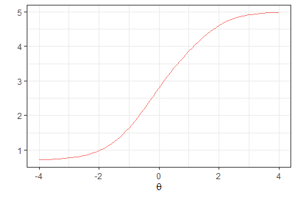

# Rirt: data analysis and parameter estimation using item response theory

<!-- badges: start -->

[](https://cran.r-project.org/package=Rirt)
<!-- badges: end -->

## Overview

Rirt provides an interface for conducting data analysis and parameter
estimation using item respone theory (IRT) efficiently in
[R](https://www.r-project.org/). A variety of unidimensional IRT models
is included, such as the 3-parameter-logstic (3PL) model, the
generalized partial credit model (GPCM), the graded response model
(GRM), and a mixture of the aforementioned models.

## Installation

Install the stable version from CRAN:

``` r
install.packages("Rirt")
```

Install the most recent version from
[github](https://github.com/xluo11/Rirt):

``` r
devtools::install_github("xluo11/Rirt")
```

## Quickstart

A common interface is created to make the package easy to use:

  - `model_[3pl/gpcm/grm/mixed]_prob`: compute the response probability
    for the given ability and item parameters
  - `model_[3pl/gpcm/grm/mixed]_info`: compute the information for the
    given ability and item parameters
  - `model_[3pl/gpcm/grm/mixed]_lh`: compute the response likelihood for
    the given ability and item parameters
  - `model_[3pl/gpcm/grm/mixed]_gendata`: generate response data and
    parameters from an IRT model
  - `model_[3pl/gpcm/grm]_plot`: plot item characteristic curves (ICC)
    or item informaiton functions (IIFs)
  - `model_[3pl/gpcm/grm]_rescale`: rescale ability and item parameters
    to a given scale
  - `model_[3pl/gpcm/grm/mixed]_eap`: score response vectors using the
    EAP method
  - `model_[3pl/gpcm/grm/mixed]_map`: score response vectors using the
    MAP method
  - `model_[3pl/gpcm/grm]_jmle`: estimate parameters using the joint
    maximum likelihood estimation method
  - `model_[3pl/gpcm/grm]_mmle`: estimate parameters using the marginal
    maximum likelihood estimation method

For example, users can quickly generate data from an IRT model of
choice:

``` r
# generate 10 people and 5 items using the 3PL model
# returns a list of 'u' (responses), 't' (ability), 'a' (item discrimination), 'b' (item difficulty), 'c' (pseudo-guessing)
model_3pl_gendata(n_p=10, n_i=5)
```

    ## $u
    ##       [,1] [,2] [,3] [,4] [,5]
    ##  [1,]    0    0    0    1    1
    ##  [2,]    1    1    1    0    1
    ##  [3,]    1    0    1    0    1
    ##  [4,]    1    1    1    1    1
    ##  [5,]    0    1    1    1    1
    ##  [6,]    0    0    1    1    0
    ##  [7,]    1    1    1    1    1
    ##  [8,]    1    1    0    1    1
    ##  [9,]    0    0    0    0    0
    ## [10,]    0    0    0    1    0
    ## 
    ## $t
    ##  [1] -0.73702846  1.06676908 -0.33373302  0.55168123  0.55682056
    ##  [6] -0.98269231  1.35183104 -0.08724449 -2.06934458 -0.95628154
    ## 
    ## $a
    ## [1] 0.9981694 1.0852205 1.1346718 0.7398013 0.7041300
    ## 
    ## $b
    ## [1] -0.44867358 -0.23459489  0.56172826 -0.57306103 -0.06587859
    ## 
    ## $c
    ## [1] 0.12161099 0.05746704 0.11697387 0.08501213 0.19766003

``` r
# generate 10 people and 5 4-category items using the GPCM model
# returns a list of 'u' (responses), 't' (ability), 'a' (item discrimination), 'b' (item difficulty), 'd' (category difficulty)
model_gpcm_gendata(n_p=10, n_i=5, n_c=4)
```

    ## $u
    ##       [,1] [,2] [,3] [,4] [,5]
    ##  [1,]    0    0    3    2    2
    ##  [2,]    0    2    3    3    3
    ##  [3,]    0    2    3    2    3
    ##  [4,]    0    3    3    2    2
    ##  [5,]    0    0    2    2    2
    ##  [6,]    0    0    0    1    2
    ##  [7,]    0    0    3    2    3
    ##  [8,]    0    2    3    2    3
    ##  [9,]    2    2    3    3    3
    ## [10,]    1    2    3    3    2
    ## 
    ## $t
    ##  [1]  0.71580543  0.16112726  0.64190638  0.07528005 -0.77135585
    ##  [6] -1.50696620  0.67370467 -0.26587520  1.48071264  0.06680653
    ## 
    ## $a
    ## [1] 0.8828596 0.7483920 0.7613749 1.0379786 0.7388671
    ## 
    ## $b
    ## [1]  1.2525124  0.3984016 -0.3909296 -0.5450076 -0.8616710
    ## 
    ## $d
    ##      [,1]       [,2]      [,3]       [,4]
    ## [1,]    0 -0.7388216 0.1009258  0.6378959
    ## [2,]    0  0.5282723 0.8109394 -1.3392117
    ## [3,]    0 -1.9253146 1.5360154  0.3892992
    ## [4,]    0  0.5554536 0.0982999 -0.6537535
    ## [5,]    0 -0.2729555 1.1965345 -0.9235790

``` r
# generate 10 people and 5 4-category items using the GRM model
# returns a list of 'u' (responses), 't' (ability), 'a' (item discrimination), 'b' (item difficulty)
model_grm_gendata(n_p=10, n_i=5, n_c=4)
```

    ## $u
    ##       [,1] [,2] [,3] [,4] [,5]
    ##  [1,]    0    0    3    2    0
    ##  [2,]    3    0    0    1    0
    ##  [3,]    1    0    0    0    0
    ##  [4,]    0    1    3    2    3
    ##  [5,]    0    1    3    1    0
    ##  [6,]    0    1    3    0    0
    ##  [7,]    0    1    0    0    0
    ##  [8,]    0    0    0    0    0
    ##  [9,]    3    3    3    3    3
    ## [10,]    3    3    3    2    3
    ## 
    ## $t
    ##  [1]  0.51726969 -0.05237931 -1.01519978  0.55510715  0.09494015
    ##  [6]  0.37745550 -1.42838419 -0.98904435  1.59408026  0.84363219
    ## 
    ## $a
    ## [1] 0.9589710 0.8230336 0.8624692 1.4175787 0.7818697
    ## 
    ## $b
    ##            [,1]       [,2]      [,3]
    ## [1,] -0.1377936  0.2826489 1.1662412
    ## [2,] -0.7830236  0.8469811 1.3414404
    ## [3,] -0.6945578 -0.3015947 0.4116890
    ## [4,] -0.6068594  0.3140926 0.9510116
    ## [5,]  0.4490137  0.4704692 0.5825619

Compute the response probability, information, and likelihood using the
3PL model:

``` r
# generate data
data <- model_3pl_gendata(n_p=10, n_i=5)
# compute P, returns a 2d array: people, item
with(data, model_3pl_prob(t, a, b, c, D=1.702))
```

    ##            [,1]      [,2]      [,3]      [,4]      [,5]
    ##  [1,] 0.3609685 0.1764401 0.1840398 0.3709739 0.4374978
    ##  [2,] 0.5794828 0.3107135 0.4200524 0.6373857 0.7433939
    ##  [3,] 0.8081244 0.5700697 0.8015521 0.9009955 0.9384708
    ##  [4,] 0.8833279 0.7067422 0.9110997 0.9571548 0.9732607
    ##  [5,] 0.6855249 0.4092094 0.5907217 0.7721538 0.8514355
    ##  [6,] 0.7790424 0.5259854 0.7531887 0.8741972 0.9213424
    ##  [7,] 0.8000765 0.5574380 0.7884019 0.8938458 0.9339416
    ##  [8,] 0.4861962 0.2445303 0.2988594 0.5160330 0.6238394
    ##  [9,] 0.9195797 0.7868290 0.9518709 0.9768332 0.9852998
    ## [10,] 0.8544134 0.6498925 0.8723540 0.9379205 0.9614693

``` r
# compute I, returns a 2d array: people, item
with(data, model_3pl_info(t, a, b, c, D=1.702))
```

    ##            [,1]      [,2]      [,3]       [,4]       [,5]
    ##  [1,] 0.3403429 0.1186590 0.2665103 0.35258616 0.76268353
    ##  [2,] 0.3983636 0.2893610 0.8506998 0.72454197 0.68922947
    ##  [3,] 0.2654653 0.4251170 0.6801583 0.35364008 0.21789268
    ##  [4,] 0.1781829 0.3793221 0.3552253 0.16773003 0.09877748
    ##  [5,] 0.3614820 0.3742370 0.9570325 0.63653053 0.46936217
    ##  [6,] 0.2934284 0.4223236 0.7840917 0.42886754 0.27263357
    ##  [7,] 0.2735266 0.4251867 0.7108104 0.37455976 0.23261817
    ##  [8,] 0.3955448 0.2116424 0.6049034 0.63398417 0.81388471
    ##  [9,] 0.1283906 0.3139195 0.2025074 0.09348562 0.05508126
    ## [10,] 0.2142975 0.4084190 0.4843669 0.23572650 0.14034014

``` r
# compute L, returns a 2d array: people, item
with(data, model_3pl_lh(u, t, a, b, c, D=1.702, log=FALSE))
```

    ##            [,1]      [,2]      [,3]      [,4]       [,5]
    ##  [1,] 0.6390315 0.8235599 0.8159602 0.3709739 0.56250220
    ##  [2,] 0.4205172 0.3107135 0.5799476 0.6373857 0.74339389
    ##  [3,] 0.8081244 0.5700697 0.8015521 0.9009955 0.06152921
    ##  [4,] 0.8833279 0.7067422 0.9110997 0.9571548 0.97326069
    ##  [5,] 0.3144751 0.5907906 0.5907217 0.7721538 0.85143552
    ##  [6,] 0.7790424 0.5259854 0.7531887 0.8741972 0.92134241
    ##  [7,] 0.8000765 0.5574380 0.7884019 0.8938458 0.93394157
    ##  [8,] 0.5138038 0.7554697 0.2988594 0.4839670 0.62383941
    ##  [9,] 0.9195797 0.2131710 0.9518709 0.9768332 0.98529985
    ## [10,] 0.8544134 0.6498925 0.8723540 0.9379205 0.96146932

Compute the response probability, information, and likelihood using the
GPCM model:

``` r
# generate data
data <- model_gpcm_gendata(n_p=10, n_i=5, n_c=3)
# compute P, returns a 3d array: people, item, category
with(data, model_gpcm_prob(t, a, b, d))
```

    ## , , 1
    ## 
    ##            [,1]      [,2]      [,3]      [,4]       [,5]
    ##  [1,] 0.3354996 0.3652935 0.1803017 0.3065639 0.14992708
    ##  [2,] 0.2985401 0.3361497 0.1492301 0.2814264 0.12651281
    ##  [3,] 0.7177997 0.6750114 0.6914101 0.5907547 0.54048962
    ##  [4,] 0.8003739 0.7517764 0.8176514 0.6711048 0.66582183
    ##  [5,] 0.5839824 0.5610900 0.4797528 0.4808886 0.36894374
    ##  [6,] 0.8704507 0.8228744 0.9076023 0.7523850 0.78122327
    ##  [7,] 0.7230880 0.6797494 0.6998446 0.5955390 0.54809604
    ##  [8,] 0.9408877 0.9033115 0.9716521 0.8562649 0.90096906
    ##  [9,] 0.2431223 0.2914943 0.1085556 0.2430856 0.09502793
    ## [10,] 0.9820773 0.9598895 0.9940061 0.9402309 0.97016803
    ## 
    ## , , 2
    ## 
    ##             [,1]       [,2]        [,3]       [,4]       [,5]
    ##  [1,] 0.36503156 0.16592013 0.053514130 0.47205052 0.24887815
    ##  [2,] 0.36499113 0.16430294 0.049778759 0.47469939 0.23550982
    ##  [3,] 0.22772488 0.14121662 0.059724451 0.34712244 0.26723547
    ##  [4,] 0.17181532 0.12301385 0.047762412 0.29057559 0.22426027
    ##  [5,] 0.29989428 0.15891988 0.067129908 0.41173896 0.29283343
    ##  [6,] 0.11757454 0.10060877 0.033335356 0.22679338 0.16689362
    ##  [7,] 0.22440175 0.14024981 0.059133189 0.34395623 0.26518954
    ##  [8,] 0.05654954 0.06636208 0.015859993 0.13705369 0.08684845
    ##  [9,] 0.35843131 0.16028193 0.043678344 0.47464258 0.21263025
    ## [10,] 0.01768260 0.03303744 0.004851627 0.05865468 0.02860468
    ## 
    ## , , 3
    ## 
    ##               [,1]        [,2]        [,3]        [,4]        [,5]
    ##  [1,] 0.2994688236 0.468786388 0.766184179 0.221385533 0.601194776
    ##  [2,] 0.3364687688 0.499547357 0.800991128 0.243874197 0.637977374
    ##  [3,] 0.0544754115 0.183771980 0.248865490 0.062122880 0.192274905
    ##  [4,] 0.0278108151 0.125209724 0.134586139 0.038319630 0.109917899
    ##  [5,] 0.1161233128 0.279990130 0.453117273 0.107372439 0.338222827
    ##  [6,] 0.0119747163 0.076516814 0.059062341 0.020821593 0.051883114
    ##  [7,] 0.0525102576 0.180000821 0.241022178 0.060504756 0.186714417
    ##  [8,] 0.0025627319 0.030326423 0.012487953 0.006681387 0.012182488
    ##  [9,] 0.3984463764 0.548223813 0.847766024 0.282271808 0.692341828
    ## [10,] 0.0002400653 0.007073108 0.001142304 0.001114459 0.001227295

``` r
# compute I, returns a 3d array: people, item, category
with(data, model_gpcm_info(t, a, b, d))
```

    ## , , 1
    ## 
    ##             [,1]       [,2]       [,3]      [,4]      [,5]
    ##  [1,] 0.62510798 0.34994060 0.32078354 0.2868053 0.2330967
    ##  [2,] 0.55615673 0.31640124 0.23126049 0.2649041 0.1806756
    ##  [3,] 0.70129697 0.48493425 1.51806565 0.3963648 0.9385987
    ##  [4,] 0.54441048 0.42369269 1.17119999 0.3725997 0.8824578
    ##  [5,] 0.82629926 0.49748643 1.31898354 0.3877298 0.7399292
    ##  [6,] 0.37225526 0.32775629 0.66023454 0.3217658 0.6681504
    ##  [7,] 0.69295794 0.48243369 1.50751977 0.3956758 0.9404498
    ##  [8,] 0.17428301 0.18028022 0.18382284 0.2171626 0.3152420
    ##  [9,] 0.44138899 0.26243458 0.13123522 0.2287843 0.1161982
    ## [10,] 0.05288157 0.06600743 0.02746983 0.1003566 0.0896758
    ## 
    ## , , 2
    ## 
    ##               [,1]        [,2]        [,3]        [,4]        [,5]
    ##  [1,] 0.6801323432 0.158946690 0.095209599 0.441625912 0.386939248
    ##  [2,] 0.6799497618 0.154650300 0.077141670 0.446830226 0.336336444
    ##  [3,] 0.2224893232 0.101451290 0.131131498 0.232900605 0.464073437
    ##  [4,] 0.1168679643 0.069329213 0.068414648 0.161328598 0.297227007
    ##  [5,] 0.4243319942 0.140905180 0.184560133 0.331975968 0.587287409
    ##  [6,] 0.0502816994 0.040073135 0.024249777 0.096990693 0.142737723
    ##  [7,] 0.2150512472 0.099538497 0.127377488 0.228524347 0.455025061
    ##  [8,] 0.0104748141 0.013244346 0.003000487 0.034759033 0.030387588
    ##  [9,] 0.6507326752 0.144303091 0.052803681 0.446718267 0.259999855
    ## [10,] 0.0009521487 0.002271841 0.000134077 0.006260574 0.002644024
    ## 
    ## , , 3
    ## 
    ##               [,1]         [,2]         [,3]         [,4]         [,5]
    ##  [1,] 5.579749e-01 0.4490838132 1.363156e+00 0.2071167904 0.9346977953
    ##  [2,] 6.268148e-01 0.4701994429 1.241288e+00 0.2295565686 0.9111086937
    ##  [3,] 5.322298e-02 0.1320234405 5.464111e-01 0.0416811321 0.3338990689
    ##  [4,] 1.891678e-02 0.0705667840 1.927805e-01 0.0212751941 0.1456814771
    ##  [5,] 1.643074e-01 0.2482512482 1.245754e+00 0.0865720095 0.6783173855
    ##  [6,] 5.121084e-03 0.0304771504 4.296485e-02 0.0089045844 0.0443736418
    ##  [7,] 5.032223e-02 0.1277507019 5.191805e-01 0.0401993293 0.3203736455
    ##  [8,] 4.747013e-04 0.0060524573 2.362544e-03 0.0016945080 0.0042625565
    ##  [9,] 7.233801e-01 0.4935702366 1.024882e+00 0.2656651093 0.8465812309
    ## [10,] 1.292671e-05 0.0004863869 3.156812e-05 0.0001189531 0.0001134429

``` r
# compute L, returns a 2d array: people, item
with(data, model_gpcm_lh(u, t, a, b, d, D=1.702, log=FALSE))
```

    ##            [,1]      [,2]      [,3]       [,4]      [,5]
    ##  [1,] 0.3354996 0.4687864 0.7661842 0.47205052 0.1499271
    ##  [2,] 0.3364688 0.1643029 0.1492301 0.28142641 0.6379774
    ##  [3,] 0.7177997 0.1412166 0.6914101 0.06212288 0.5404896
    ##  [4,] 0.8003739 0.1230138 0.8176514 0.67110478 0.2242603
    ##  [5,] 0.5839824 0.5610900 0.4797528 0.41173896 0.2928334
    ##  [6,] 0.8704507 0.1006088 0.9076023 0.75238503 0.7812233
    ##  [7,] 0.2244018 0.1402498 0.6998446 0.34395623 0.5480960
    ##  [8,] 0.9408877 0.9033115 0.9716521 0.85626493 0.9009691
    ##  [9,] 0.3584313 0.5482238 0.8477660 0.24308561 0.6923418
    ## [10,] 0.9820773 0.9598895 0.9940061 0.94023086 0.9701680

Compute the response probability, information, and likelihood using the
GRM model:

``` r
# generate data
data <- model_grm_gendata(n_p=10, n_i=5, n_c=3)
# compute P, returns a 3d array: people, item, category
with(data, model_grm_prob(t, a, b))
```

    ## , , 1
    ## 
    ##             [,1]       [,2]       [,3]       [,4]       [,5]
    ##  [1,] 0.46874907 0.34455110 0.49171940 0.26674793 0.56119361
    ##  [2,] 0.44431842 0.31904938 0.45589862 0.24242890 0.54044458
    ##  [3,] 0.21262551 0.11645956 0.14664585 0.07224665 0.31813989
    ##  [4,] 0.53704511 0.41984769 0.59054431 0.34187464 0.61751922
    ##  [5,] 0.17317187 0.08921036 0.10601893 0.05297255 0.27313616
    ##  [6,] 0.48843782 0.36565918 0.52049897 0.28731713 0.57766864
    ##  [7,] 0.04084875 0.01500415 0.01146629 0.00698243 0.08824085
    ##  [8,] 0.62687904 0.52731058 0.71234580 0.45692768 0.68879170
    ##  [9,] 0.29473514 0.18002034 0.24530039 0.12087628 0.40361019
    ## [10,] 0.93566990 0.93283454 0.98299202 0.93322727 0.93293255
    ## 
    ## , , 2
    ## 
    ##             [,1]       [,2]       [,3]       [,4]        [,5]
    ##  [1,] 0.16802383 0.48707488 0.24493278 0.39807532 0.007197214
    ##  [2,] 0.16938295 0.49584456 0.25193807 0.39324577 0.007263255
    ##  [3,] 0.13656033 0.43680752 0.18530197 0.22579698 0.006385403
    ##  [4,] 0.16036688 0.45194177 0.21604232 0.39718704 0.006891671
    ##  [5,] 0.12067764 0.39004110 0.14932686 0.18073281 0.005851710
    ##  [6,] 0.16638226 0.47848451 0.23787904 0.39999835 0.007126919
    ##  [7,] 0.03716675 0.11020081 0.02098437 0.02994043 0.002384370
    ##  [8,] 0.14260545 0.38559376 0.16511164 0.36410082 0.006241677
    ##  [9,] 0.15891218 0.49348080 0.23918693 0.30759048 0.007067665
    ## [10,] 0.03088351 0.05956066 0.01105968 0.05381989 0.001809038
    ## 
    ## , , 3
    ## 
    ##             [,1]        [,2]        [,3]       [,4]       [,5]
    ##  [1,] 0.36322711 0.168374024 0.263347818 0.33517674 0.43160917
    ##  [2,] 0.38629863 0.185106064 0.292163309 0.36432533 0.45229217
    ##  [3,] 0.65081416 0.446732922 0.668052180 0.70195637 0.67547470
    ##  [4,] 0.30258801 0.128210534 0.193413368 0.26093833 0.37558911
    ##  [5,] 0.70615049 0.520748534 0.744654216 0.76629464 0.72101213
    ##  [6,] 0.34517992 0.155856310 0.241621991 0.31268452 0.41520444
    ##  [7,] 0.92198450 0.874795032 0.967549343 0.96307714 0.90937478
    ##  [8,] 0.23051552 0.087095660 0.122542565 0.17897150 0.30496662
    ##  [9,] 0.54635268 0.326498859 0.515512674 0.57153325 0.58932215
    ## [10,] 0.03344659 0.007604802 0.005948298 0.01295284 0.06525841

``` r
# compute I, returns a 3d array: people, item, category
with(data, model_grm_info(t, a, b))
```

    ## , , 1
    ## 
    ##              [,1]         [,2]         [,3]         [,4]        [,5]
    ##  [1,] 0.165584696 0.1506680434 0.3713410462 0.1254504679 0.142182475
    ##  [2,] 0.155616017 0.1342166699 0.3417048307 0.1070555131 0.138098167
    ##  [3,] 0.050495390 0.0232034068 0.0554502641 0.0116435337 0.071003415
    ##  [4,] 0.189408674 0.1980161457 0.4314660501 0.1849520926 0.150057693
    ##  [5,] 0.035173014 0.0140353661 0.0303619659 0.0063897111 0.055790359
    ##  [6,] 0.173123751 0.1642293077 0.3925220227 0.1414608340 0.144996863
    ##  [7,] 0.002270306 0.0004293707 0.0003927101 0.0001164091 0.007304108
    ##  [8,] 0.207996871 0.2544977139 0.4410493588 0.2726273728 0.151905911
    ##  [9,] 0.086907196 0.0514542540 0.1372161895 0.0308851001 0.099954454
    ## [10,] 0.079891248 0.1131697336 0.0496577925 0.1398269392 0.060056492
    ## 
    ## , , 2
    ## 
    ##              [,1]        [,2]         [,3]        [,4]         [,5]
    ##  [1,] 0.114482231 0.345052773 0.3285438862 0.400499126 0.0036400270
    ##  [2,] 0.116286471 0.353414896 0.3462623828 0.392635941 0.0037071305
    ##  [3,] 0.076453862 0.296078467 0.1942308473 0.149976306 0.0028652165
    ##  [4,] 0.104565262 0.310965094 0.2596840628 0.399050679 0.0033375419
    ##  [5,] 0.060032177 0.249849780 0.1285584175 0.099625397 0.0024063009
    ##  [6,] 0.112320672 0.336797173 0.3110991622 0.403638147 0.0035692736
    ##  [7,] 0.005857932 0.026525154 0.0027094939 0.003059107 0.0003995339
    ##  [8,] 0.083198055 0.245464944 0.1558735079 0.345883292 0.0027376904
    ##  [9,] 0.102728942 0.351167970 0.3143033996 0.259704926 0.0035101722
    ## [10,] 0.004053222 0.008096164 0.0007562981 0.009718405 0.0002299882
    ## 
    ## , , 3
    ## 
    ##              [,1]         [,2]         [,3]        [,4]       [,5]
    ##  [1,] 0.119173784 0.0456513124 0.1543677829 0.179585314 0.10893717
    ##  [2,] 0.129910150 0.0540651505 0.1825656883 0.202875917 0.11527491
    ##  [3,] 0.209802311 0.2137990556 0.4476363341 0.353115631 0.15234017
    ##  [4,] 0.090580038 0.0277481523 0.0911714229 0.120996634 0.09062419
    ##  [5,] 0.207854369 0.2516486462 0.4278314788 0.329972014 0.14921695
    ##  [6,] 0.110675808 0.0397045426 0.1337806767 0.161579307 0.10372316
    ##  [7,] 0.094073610 0.1855278935 0.0917919261 0.082344447 0.07710501
    ##  [8,] 0.058001583 0.0134089058 0.0398139009 0.063232865 0.06650556
    ##  [9,] 0.192089736 0.1390198154 0.3890414302 0.336524730 0.14674202
    ## [10,] 0.001533802 0.0001111311 0.0001062745 0.000398185 0.00409555

``` r
# compute L, returns a 2d array: people, item
with(data, model_grm_lh(u, t, a, b, D=1.702, log=FALSE))
```

    ##             [,1]       [,2]      [,3]      [,4]      [,5]
    ##  [1,] 0.36322711 0.16837402 0.2449328 0.3351767 0.4316092
    ##  [2,] 0.38629863 0.49584456 0.4558986 0.3643253 0.5404446
    ##  [3,] 0.65081416 0.11645956 0.1466459 0.7019564 0.6754747
    ##  [4,] 0.16036688 0.45194177 0.5905443 0.2609383 0.3755891
    ##  [5,] 0.70615049 0.39004110 0.1493269 0.7662946 0.7210121
    ##  [6,] 0.48843782 0.47848451 0.5204990 0.3999984 0.4152044
    ##  [7,] 0.04084875 0.87479503 0.9675493 0.9630771 0.9093748
    ##  [8,] 0.62687904 0.08709566 0.7123458 0.4569277 0.3049666
    ##  [9,] 0.54635268 0.32649886 0.5155127 0.5715332 0.4036102
    ## [10,] 0.93566990 0.93283454 0.9829920 0.9332273 0.9329326

Compute the response probability, information, and likelihood using a
mixture of IRT models:

``` r
# generate data, returns response, theta, and a list of items
data <- model_mixed_gendata(n_p=10, n_3pl=5, n_gpcm=3, n_grm=3, n_c=3)
# compute P, returns a list
with(data, model_mixed_prob(t, items))
```

    ## $`3pl`
    ##            [,1]      [,2]      [,3]      [,4]      [,5]
    ##  [1,] 0.4638027 0.7876843 0.7775934 0.6172807 0.8715012
    ##  [2,] 0.1005899 0.1675718 0.2532055 0.1756530 0.3408528
    ##  [3,] 0.1485265 0.3676959 0.4545735 0.3166527 0.5898376
    ##  [4,] 0.1362926 0.3276309 0.4197982 0.2908427 0.5514164
    ##  [5,] 0.3948003 0.7384522 0.7392978 0.5731808 0.8443237
    ##  [6,] 0.1612890 0.4046603 0.4853123 0.3401780 0.6223262
    ##  [7,] 0.1798952 0.4516805 0.5229803 0.3700406 0.6603308
    ##  [8,] 0.6311038 0.8746184 0.8501477 0.7114999 0.9190191
    ##  [9,] 0.7605168 0.9238484 0.8966344 0.7818173 0.9467997
    ## [10,] 0.8717470 0.9594914 0.9354970 0.8493599 0.9683955
    ## 
    ## $gpcm
    ## , , 1
    ## 
    ##              [,1]      [,2]       [,3]
    ##  [1,] 0.036972214 0.6297609 0.40827616
    ##  [2,] 0.853443457 0.9746159 0.98030083
    ##  [3,] 0.475656048 0.9184826 0.90858017
    ##  [4,] 0.549143806 0.9311171 0.92682974
    ##  [5,] 0.058338965 0.6950175 0.51501079
    ##  [6,] 0.411639188 0.9058485 0.88938454
    ##  [7,] 0.336747012 0.8881083 0.86104800
    ##  [8,] 0.012381074 0.4548380 0.19240789
    ##  [9,] 0.004628683 0.2990495 0.08053891
    ## [10,] 0.001388117 0.1517540 0.02392218
    ## 
    ## , , 2
    ## 
    ##             [,1]       [,2]       [,3]
    ##  [1,] 0.11272074 0.24151671 0.27665133
    ##  [2,] 0.11090037 0.02452634 0.01907532
    ##  [3,] 0.23560227 0.07337181 0.07967640
    ##  [4,] 0.22425853 0.06296540 0.06541128
    ##  [5,] 0.13768281 0.21368175 0.26161976
    ##  [6,] 0.24055113 0.08346395 0.09393907
    ##  [7,] 0.24000812 0.09712894 0.11371220
    ##  [8,] 0.06784200 0.28934900 0.25216058
    ##  [9,] 0.04222662 0.29540788 0.18730724
    ## [10,] 0.02339068 0.25460374 0.11096530
    ## 
    ## , , 3
    ## 
    ##             [,1]         [,2]         [,3]
    ##  [1,] 0.85030705 0.1287223905 0.3150725099
    ##  [2,] 0.03565618 0.0008577634 0.0006238544
    ##  [3,] 0.28874169 0.0081455977 0.0117434351
    ##  [4,] 0.22659767 0.0059174548 0.0077589757
    ##  [5,] 0.80397823 0.0913007937 0.2233694490
    ##  [6,] 0.34780968 0.0106875375 0.0166763875
    ##  [7,] 0.42324487 0.0147627315 0.0252397932
    ##  [8,] 0.91977693 0.2558130434 0.5554315244
    ##  [9,] 0.95314470 0.4055426308 0.7321538489
    ## [10,] 0.97522120 0.5936422645 0.8651125217
    ## 
    ## 
    ## $grm
    ## , , 1
    ## 
    ##             [,1]       [,2]      [,3]
    ##  [1,] 0.16198717 0.22075570 0.4532402
    ##  [2,] 0.93053209 0.83939376 0.8625801
    ##  [3,] 0.68944467 0.60290244 0.7267857
    ##  [4,] 0.74207504 0.64471299 0.7506738
    ##  [5,] 0.21423844 0.26411050 0.4941757
    ##  [6,] 0.64001783 0.56582435 0.7052235
    ##  [7,] 0.57657689 0.52034042 0.6780677
    ##  [8,] 0.08083886 0.14150236 0.3626848
    ##  [9,] 0.04246285 0.09331656 0.2909464
    ## [10,] 0.01907808 0.05516628 0.2167887
    ## 
    ## , , 2
    ## 
    ##             [,1]      [,2]       [,3]
    ##  [1,] 0.40192168 0.4646233 0.04412764
    ##  [2,] 0.05843141 0.1363280 0.01967340
    ##  [3,] 0.24746870 0.3182017 0.03371633
    ##  [4,] 0.20853418 0.2884143 0.03165130
    ##  [5,] 0.43164520 0.4699181 0.04418884
    ##  [6,] 0.28242422 0.3434417 0.03542770
    ##  [7,] 0.32450416 0.3726137 0.03737451
    ##  [8,] 0.28957399 0.4174728 0.04183400
    ##  [9,] 0.18632342 0.3484676 0.03782801
    ## [10,] 0.09605023 0.2546912 0.03156335
    ## 
    ## , , 3
    ## 
    ##             [,1]       [,2]      [,3]
    ##  [1,] 0.43609115 0.31462096 0.5026321
    ##  [2,] 0.01103650 0.02427827 0.1177465
    ##  [3,] 0.06308663 0.07889583 0.2394980
    ##  [4,] 0.04939078 0.06687271 0.2176749
    ##  [5,] 0.35411635 0.26597145 0.4616355
    ##  [6,] 0.07755795 0.09073397 0.2593488
    ##  [7,] 0.09891895 0.10704585 0.2845578
    ##  [8,] 0.62958715 0.44102483 0.5954812
    ##  [9,] 0.77121373 0.55821587 0.6712256
    ## [10,] 0.88487169 0.69014253 0.7516480

``` r
# compute I, returns a list when combine=FALSE or a 2d array when combine=TRUE
with(data, model_mixed_info(t, items, combine=TRUE))
```

    ##              [,1]      [,2]      [,3]       [,4]       [,5]       [,6]
    ##  [1,] 0.775452241 0.4726678 0.2872265 0.30086135 0.21143290 0.55698184
    ##  [2,] 0.005666158 0.1326179 0.1607771 0.09282275 0.26558509 0.54355573
    ##  [3,] 0.096797338 0.4977745 0.3353109 0.21842316 0.40015026 1.79963732
    ##  [4,] 0.067497120 0.4399661 0.3153444 0.19895303 0.39714881 1.65715044
    ##  [5,] 0.684412242 0.5376474 0.3155627 0.30604296 0.24602566 0.75576322
    ##  [6,] 0.129542690 0.5424508 0.3490453 0.23457042 0.39738759 1.86356898
    ##  [7,] 0.179626123 0.5867696 0.3607629 0.25279992 0.38793540 1.85650163
    ##  [8,] 0.820309938 0.3169700 0.2165739 0.26947236 0.14246668 0.26839541
    ##  [9,] 0.678128375 0.2055471 0.1595932 0.22792844 0.09713821 0.14331448
    ## [10,] 0.430491908 0.1143631 0.1049195 0.17339460 0.05934461 0.06971581
    ##             [,7]      [,8]      [,9]     [,10]     [,11]
    ##  [1,] 0.93291961 2.2320363 1.2580533 0.6020251 0.2639822
    ##  [2,] 0.05013278 0.0660799 0.2879373 0.2849627 0.1207019
    ##  [3,] 0.18001324 0.3623153 0.9746404 0.5250644 0.2038961
    ##  [4,] 0.14898978 0.2807689 0.8637916 0.4967046 0.1918171
    ##  [5,] 0.77554800 2.0404707 1.2839438 0.6028639 0.2643314
    ##  [6,] 0.21183370 0.4511204 1.0606431 0.5457333 0.2138661
    ##  [7,] 0.25764036 0.5862647 1.1472089 0.5657805 0.2251630
    ##  [8,] 1.23368651 1.9240616 1.0766585 0.5885706 0.2508616
    ##  [9,] 1.27452120 1.2120876 0.7934486 0.5494808 0.2277877
    ## [10,] 1.01139893 0.5666544 0.4544041 0.4594141 0.1913015

``` r
# compute L, returns a list when combine=FALSE or a 2d array when combine=TRUE
with(data, model_mixed_lh(u, t, items, combine=TRUE))
```

    ##            [,1]       [,2]      [,3]      [,4]      [,5]      [,6]
    ##  [1,] 0.5361973 0.78768427 0.7775934 0.6172807 0.8715012 0.8503070
    ##  [2,] 0.8994101 0.83242816 0.7467945 0.8243470 0.6591472 0.8534435
    ##  [3,] 0.8514735 0.36769585 0.5454265 0.3166527 0.5898376 0.2887417
    ##  [4,] 0.1362926 0.67236911 0.4197982 0.7091573 0.4485836 0.5491438
    ##  [5,] 0.3948003 0.73845224 0.7392978 0.5731808 0.8443237 0.8039782
    ##  [6,] 0.8387110 0.59533969 0.5146877 0.3401780 0.6223262 0.2405511
    ##  [7,] 0.8201048 0.54831954 0.5229803 0.6299594 0.6603308 0.4232449
    ##  [8,] 0.6311038 0.87461842 0.8501477 0.7114999 0.9190191 0.9197769
    ##  [9,] 0.2394832 0.92384844 0.8966344 0.7818173 0.9467997 0.9531447
    ## [10,] 0.8717470 0.04050863 0.9354970 0.8493599 0.9683955 0.9752212
    ##            [,7]      [,8]      [,9]     [,10]     [,11]
    ##  [1,] 0.6297609 0.4082762 0.1619872 0.2207557 0.4532402
    ##  [2,] 0.9746159 0.9803008 0.9305321 0.8393938 0.8625801
    ##  [3,] 0.9184826 0.9085802 0.6894447 0.6029024 0.7267857
    ##  [4,] 0.0629654 0.9268297 0.7420750 0.6447130 0.2176749
    ##  [5,] 0.2136817 0.5150108 0.4316452 0.2641105 0.4941757
    ##  [6,] 0.9058485 0.8893845 0.6400178 0.5658244 0.2593488
    ##  [7,] 0.8881083 0.8610480 0.3245042 0.1070459 0.6780677
    ##  [8,] 0.2893490 0.5554315 0.6295871 0.4410248 0.3626848
    ##  [9,] 0.2954079 0.1873072 0.7712137 0.3484676 0.2909464
    ## [10,] 0.5936423 0.8651125 0.8848717 0.6901425 0.2167887

## Visualization

Visualization is essential in IRT data analysis, and this package makes
it really easy to produce high-quality characteristic curves and
information function curves at both item and test level.

For example, users can draw ICCs and IIFs for a set of 3PL items:

``` r
data <- model_3pl_gendata(1, 5)
# item characteristic curves
with(data, model_3pl_plot(a, b, c, type='prob', total=FALSE))
```

<!-- -->

``` r
# test characteristic curves
with(data, model_3pl_plot(a, b, c, type='prob', total=TRUE))
```

<!-- -->

``` r
# item information funciton curves
with(data, model_3pl_plot(a, b, c, type='info', total=FALSE))
```

<!-- -->

``` r
# test information function curves
with(data, model_3pl_plot(a, b, c, type='info', total=TRUE))
```

<!-- -->

Draw ICCs and IIFs for a set of GPCM items:

``` r
# Reproduce Figure 1 in Muraki's 1992 APM article
b <- matrix(c(-2, 0, 2, -.5, 0, 2, -.5, 0, 2), nrow=3, byrow=TRUE)
model_gpcm_plot(a=c(1, 1, .7), b=rowMeans(b), d=rowMeans(b)-b, D=1.0, d0=0)
```

<!-- -->

``` r
# Reproduce Figure 2 in Muraki's 1992 APM article
b <- matrix(c(.5, 0, NA, 0, 0, 0), nrow=2, byrow=TRUE)
model_gpcm_plot(a=.7, b=rowMeans(b, na.rm=TRUE), d=rowMeans(b, na.rm=TRUE)-b, D=1.0, d0=0)
```

<!-- -->

``` r
# Reproduce Figure 3 in Muraki's 1992 APM article
b <- matrix(c(1.759, -1.643, 3.970, -2.764), nrow=2, byrow=TRUE)
model_gpcm_plot(a=c(.778,.946), b=rowMeans(b), d=rowMeans(b)-b, D=1.0, d0=0)
```

<!-- -->

``` r
# Reproduce Figure 1 in Muraki's 1993 APM article
b <- matrix(c(0, -2, 4, 0, -2, 2, 0, -2, 0, 0, -2, -2, 0, -2, -4), nrow=5, byrow=TRUE)
model_gpcm_plot(a=1, b=rowMeans(b), d=rowMeans(b)-b, D=1.0)
```

<!-- -->

``` r
# Reproduce Figure 2 in Muraki's 1993 APM article
b <- matrix(c(0, -2, 4, 0, -2, 2, 0, -2, 0, 0, -2, -2, 0, -2, -4), nrow=5, byrow=TRUE)
model_gpcm_plot(a=1, b=rowMeans(b), d=rowMeans(b)-b, D=1.0, type='info', item_level=TRUE)
```

<!-- -->

Draw ICCs and IIFs for a set of GRM items:

``` r
data <- model_grm_gendata(1, 3, n_c=3)
# item category characteristic curves
with(data, model_grm_plot(a, b, type='prob', total=FALSE))
```

<!-- -->

``` r
# item category information funciton curves
with(data, model_grm_plot(a, b, type='info', total=FALSE))
```

<!-- -->

## Estimation

IRT models describe the interaction between people and items using
probabilistic functions. However, neither people nor item parameters are
naturally known in reality and they have to be estimated based on the
observed response data. Thus, parameter estimation, which calibrates
items and scores response vectors, is the centerpiece of data analysis
in IRT.

Here are some examples of estimating model parameters using the 3PL
model in this package.

``` r
# generate data
data <- model_3pl_gendata(2000, 40)
# score response vectors using EAP
scores <- with(data, model_3pl_eap(u, a, b, c))
round(c(corr=cor(data$t, scores$t), rmse=rmse(data$t, scores$t)), 2)
```

    ## corr rmse 
    ## 0.96 0.28

``` r
# score response vectors using MAP
scores <- with(data, model_3pl_map(u, a, b, c))
round(c(corr=cor(data$t, scores$t), rmse=rmse(data$t, scores$t)), 2)
```

    ## corr rmse 
    ## 0.96 0.28

``` r
# calibrate items using joint MLE
calib <- with(data, model_3pl_jmle(u, true_params=data))
```

<!-- -->

    ## t: corr = 0.959, rmse = 0.287
    ## a: corr = 0.905, rmse = 0.129
    ## b: corr = 0.98, rmse = 0.127
    ## c: corr = 0.489, rmse = 0.06

``` r
# calibrate items using marginal MLE
calib <- with(data, model_3pl_mmle(u, true_params=data))
```

<!-- -->

    ## t: corr = 0.958, rmse = 0.287
    ## a: corr = 0.932, rmse = 0.089
    ## b: corr = 0.98, rmse = 0.118
    ## c: corr = 0.424, rmse = 0.056

``` r
# calibrate items using joint MLE and fix c=0
calib <- with(data, model_3pl_jmle(u, c=0, true_params=data))
```

<!-- -->

    ## t: corr = 0.955, rmse = 0.298
    ## a: corr = 0.81, rmse = 0.185
    ## b: corr = 0.976, rmse = 0.23

``` r
# calibrate items using joint MLE and fix a=1 and c=0
calib <- with(data, model_3pl_jmle(u, a=1, c=0, true_params=data))
```

<!-- -->

    ## t: corr = 0.955, rmse = 0.3
    ## b: corr = 0.976, rmse = 0.232

Here are examples of estimating parameters using the GPCM model.

``` r
# generate data
data <- model_gpcm_gendata(1000, 20, n_c=3)
# score response vectors using EAP
scores <- with(data, model_gpcm_eap(u, a, b, d))
round(c(corr=cor(data$t, scores$t), rmse=rmse(data$t, scores$t)), 2)
```

    ## corr rmse 
    ## 0.96 0.28

``` r
# score response vectors using MAP
scores <- with(data, model_gpcm_map(u, a, b, d))
round(c(corr=cor(data$t, scores$t), rmse=rmse(data$t, scores$t)), 2)
```

    ## corr rmse 
    ## 0.96 0.27

``` r
# calibrate items using joint MLE
calib <- with(data, model_gpcm_jmle(u, true_params=data))
```

<!-- -->

    ## t: corr = 0.962, rmse = 0.276
    ## a: corr = 0.963, rmse = 0.092
    ## b: corr = 0.998, rmse = 0.07
    ## d_2: corr = 0.993, rmse = 0.089
    ## d_3: corr = 0.993, rmse = 0.089

``` r
# calibrate items using marginal MLE
calib <- with(data, model_gpcm_mmle(u, true_params=data))
```

<!-- -->

    ## t: corr = 0.96, rmse = 0.283
    ## a: corr = 0.959, rmse = 0.076
    ## b: corr = 0.999, rmse = 0.085
    ## d_2: corr = 0.994, rmse = 0.065
    ## d_3: corr = 0.994, rmse = 0.065

Here are examples of estimating parameters using the GRM model.

``` r
# generate data
data <- model_grm_gendata(1000, 20, n_c=3)
# score response vectors using EAP
scores <- with(data, model_grm_eap(u, a, b))
round(c(corr=cor(data$t, scores$t), rmse=rmse(data$t, scores$t)), 2)
```

    ## corr rmse 
    ## 0.95 0.30

``` r
# score response vectors using MAP
scores <- with(data, model_grm_map(u, a, b))
round(c(corr=cor(data$t, scores$t), rmse=rmse(data$t, scores$t)), 2)
```

    ## corr rmse 
    ## 0.95 0.30

``` r
# calibrate items using joint MLE
calib <- with(data, model_grm_jmle(u, true_params=data))
```

<!-- -->

    ## t: corr = 0.953, rmse = 0.308
    ## a: corr = 0.95, rmse = 0.11
    ## b_1: corr = 0.997, rmse = 0.082
    ## b_2: corr = 0.997, rmse = 0.061

``` r
# calibrate items using marginal MLE
calib <- with(data, model_grm_mmle(u, true_params=data))
```

<!-- -->

    ## t: corr = 0.953, rmse = 0.3
    ## a: corr = 0.952, rmse = 0.058
    ## b_1: corr = 0.997, rmse = 0.057
    ## b_2: corr = 0.997, rmse = 0.053

Here are examples of estimating parameters using the mixed model.

``` r
# generate data
data <- model_mixed_gendata(2000, n_3pl=40, n_gpcm=10, n_grm=10, n_c=3)
# score response vectors using EAP
scores <- with(data, model_mixed_eap(u, items))
round(c(corr=cor(data$t, scores$t), rmse=rmse(data$t, scores$t)), 2)
```

    ## corr rmse 
    ## 0.97 0.24

``` r
# score response vectors using MAP
scores <- with(data, model_mixed_map(u, items))
round(c(corr=cor(data$t, scores$t), rmse=rmse(data$t, scores$t)), 2)
```

    ## corr rmse 
    ## 0.98 0.22

## Getting help

If you encounter a bug, please post a code example that exposes the bug
on [github](https://github.com/xluo11/Rirt/issues). You can post your
questions and feature requests on
[github](https://github.com/xluo11/Rirt/issues) or contact the
[author](mailto:xluo1986@gmail.com).
